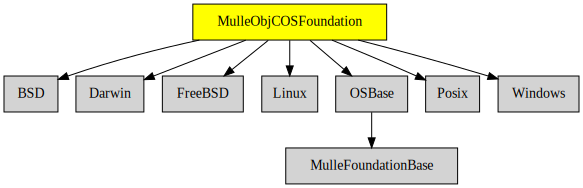

# MulleObjCOSFoundation

#### 💻 Platform-dependent classes and categories like NSTask, NSPipe

These classes build on **MulleObjCStandardFoundation** and provide OS-specific
functionality. This library also adds categories on NSString to deal with
the native C String encoding of the platform.

It builds differently on each platform.

> Note: a few tests may fail because of missing implementations.
>
> Ideally - maybe - this library should move all the OS-specifica into C
> libraries and then cease to exist.


| Release Version                                       | Release Notes  | AI Documentation
|-------------------------------------------------------|----------------|---------------
|  [](//github.com/MulleFoundation/MulleObjCOSFoundation/actions) | [RELEASENOTES](RELEASENOTES.md) | [DeepWiki for MulleObjCOSFoundation](https://deepwiki.com/MulleFoundation/MulleObjCOSFoundation)


## API

### Classes

| Class                   | Description
|-------------------------|----------------------------------------
| `NSBundle`              | Plugins and dynamic loading
| `NSDirectoryEnumerator` | List folder contents of the filesystem
| `NSFileHandle`          | Wrapper for file descriptors (open)
| `NSFilemanager`         | Filesystem management, like file deletion
| `NSPipe`                | Support for inter-process pipes
| `NSProcessInfo`         | Access to the environment and arguments
| `NSRunLoop`             | A wrapper around `select()` usually
| `NSTask`                | Does vfork() and execvs() on Unix
| `NSUserDefaults`        | Access to the program settings (registry)


### You are here



## Add

Use [mulle-sde](//github.com/mulle-sde) to add MulleObjCOSFoundation to your project:

``` sh
mulle-sde add github:MulleFoundation/MulleObjCOSFoundation
```

## Install

Use [mulle-sde](//github.com/mulle-sde) to build and install MulleObjCOSFoundation:

``` sh
mulle-sde install --prefix /usr/local \
   https://github.com/MulleFoundation/MulleObjCOSFoundation/archive/latest.tar.gz
```

### Legacy Installation


Download the latest [tar](https://github.com/MulleFoundation/MulleObjCOSFoundation/archive/refs/tags/latest.tar.gz) or [zip](https://github.com/MulleFoundation/MulleObjCOSFoundation/archive/refs/tags/latest.zip) archive and unpack it.

Install **MulleObjCOSFoundation** into `/usr/local` with [cmake](https://cmake.org):

``` sh
cmake -B build \
      -DCMAKE_INSTALL_PREFIX=/usr/local \
      -DCMAKE_PREFIX_PATH=/usr/local \
      -DCMAKE_BUILD_TYPE=Release &&
cmake --build build --config Release &&
cmake --install build --config Release
```

## Author

[Nat!](https://mulle-kybernetik.com/weblog) for Mulle kybernetiK  


#### MEMO: WARUM KOMMEN DIE ÄNDERUNGEN NICHT AN

mulle-test kann nur mulle-craft aufrufen und weiss nix von den subprojects.
Die sind aber wie "dependencies" und werden dann dazugelinkt. Änderungen kriegt
man mit mulle-test clean nicht rein, man muss mulle-sde craft machen.
